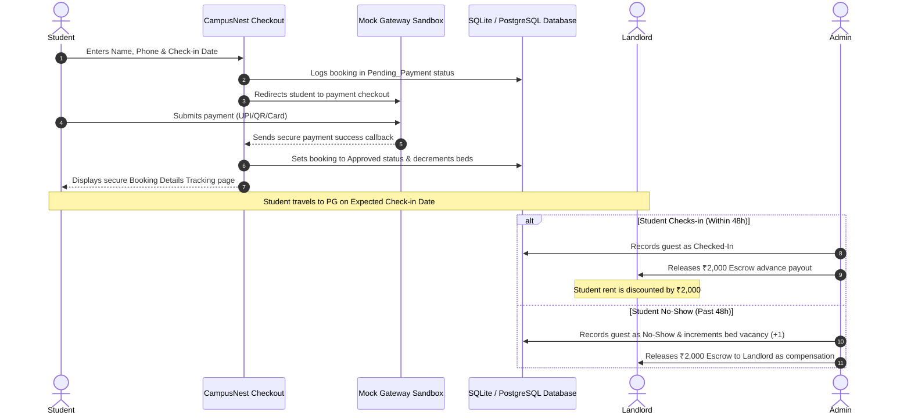
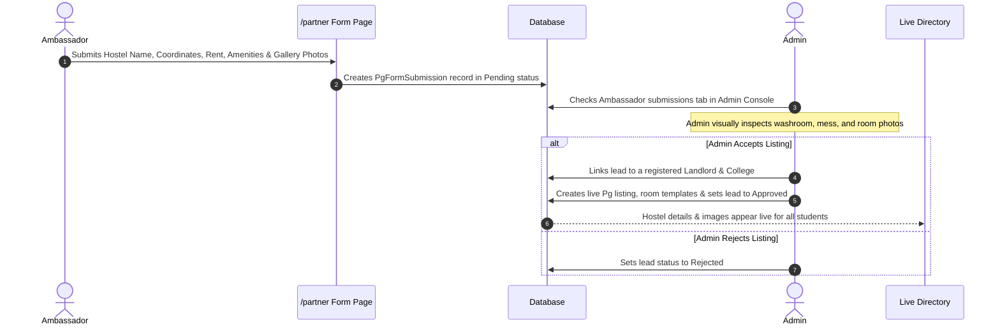

# CampusNest - Direct PG Accommodations & Escrow Booking Portal

CampusNest is a modern, responsive, mobile-first web platform tailored for students at professional colleges in **Tier-2 and Tier-3 cities** (e.g., Nandyal, Kurnool) to search, verify, and reserve Paying Guest (PG) hostels near their campus outskirts. It connects remote students directly with local PG landlords while offering a secure escrow advance deposit system.

---

## 🚀 1. The Problem Statement
*   **The Outskirts Gap:** Most Tier-2/3 engineering and medical colleges (like RGMCET or Santhiram in Nandyal) are established far away from city centers. Local PGs situated around these remote campus outskirts have zero online presence.
*   **Information Disconnection:** Local PG owners are not tech-savvy and rely solely on physical banners and word-of-mouth. Remote students traveling from other districts cannot discover, compare, or contact them before arriving.
*   **The "First-Week" Struggle:** Students and parents travel early, rent expensive city hotel rooms, and physically search for PGs under the sun, often settling for sub-optimal hostels.
*   **Trust and Safety:** Students fear fake online listings, while landlords fear "ghost bookings" (students who book verbally but fail to show up, leaving the landlord with vacant beds and lost income).
*   **Fake Payment Proofs:** Students frequently submit fake UPI transaction receipts (screenshots of successful payments or invalid UTR numbers) to landlords, leading to reservation disputes.

---

## 💡 2. The Solution Proposed
*   **Proximity-Sorted Search:** Students search by entering their college name (e.g., *RGMCET*). PGs are automatically sorted and displayed by distance (in kilometers) from that college's main gate.
*   **Swipeable Photo Galleries:** Listings feature dynamic cover carousels and room category modals showcasing verified pictures of washroom cleanliness, study desks, mess food, and bedroom settings.
*   **Escrow Reservation Model:** To reserve a bed, students pay a dynamic advance deposit (reservation fee + ₹200 platform service commission fee). The advance is held securely in **escrow** by CampusNest and released to the landlord 24 hours after check-in. If the student fails to show up, it is released to the owner as compensation.
*   **Fraud-Proof UPI Intent Redirect & Segregated Auditing:**
    *   **Direct UPI Redirects:** Students use deep-links that open PhonePe, Google Pay, or Paytm directly with the dynamic checkout amount pre-filled.
    *   **12-Digit UTR Verification:** Students must input their 12-digit transaction UTR code. The reservation goes into a `Payment_Submitted` state, hiding it from the landlord.
    *   **Segregated Admin Auditing:** Only the Super Admin (matching statement records at `93913333699`) sees the UTR field. Admin clicks "Verify Payment" to approve the transaction.
    *   **Landlord Confirmation:** The landlord is notified only after admin verification, only having to click **Accept** or **Reject** to confirm the guest, with sensitive financial info hidden.
*   **Boutique Visual Design & Dynamic Animations:**
    *   **Scroll-Aware Floating Header:** The navigation bar shifts dynamically from a transparent overlay to a frosted-cream glass container on scroll.
    *   **Slow Zoom Hero Banner:** Toggles subtle background animations on load.
    *   **Popin-Inspired Filter Showcase:** Segment listings instantaneously client-side using filter capsules showing matching counts (e.g. *All Listings*, *Under 1.0 KM*, *Budget*).
    *   **Auto-Playing Reviews Carousel:** Testimonial reviews slide automatically every 5 seconds.
    *   **Interactive Counters:** Stats count up dynamically on load.
*   **Ambassador & Landlord Edit Pipelines with Comparative Diffs:**
    *   **Dynamic Inputs:** Ambassadors `/partner` and landlords `/owner/dashboard` submit listing updates with dynamic re-orderable photo queues, dynamic room configuration blocks (sharing types, rent, beds left), and optional custom amenities.
    *   **Admin Comparative Diff Panel:** Super Admin compares proposed landlord modifications side-by-side on a comparative panel to approve or reject edits before going live.
*   **Admin-Moderated Q&As:** Students post anonymous questions. The Admin Support team contacts the landlord to verify the details and publishes the FAQ answer publicly.
*   **Float Support Widget:** A site-wide floating support button allows students, owners, and ambassadors to connect with our central operations hotline at any time.

---

## 🛠 3. Tech Stack
CampusNest is optimized for high-performance and **$0 operational costs** on free tiers:

*   **Frontend & Server:** Next.js (App Router, React, TypeScript) hosted on **Vercel** (Free Tier).
*   **Database ORM:** Prisma Client.
*   **Database Engines:**
    *   *Local Development:* **SQLite** (`prisma/dev.db`) for zero-config, immediate testing.
    *   *Production:* **PostgreSQL** hosted on **Supabase** (Free Tier up to 500MB).
*   **Styling:** Tailwind CSS v4 with mobile-first responsive utilities (hamburger menus, swipeable touch components, and horizontal scrollbox tables).
*   **Security:** SHA256 encryption using Node.js `crypto` module for secure, zero-dependency password verification.

---

## 📊 4. System Architecture & Workflows

### System Entities (Database Schema Models)
```
┌──────────────┐       1:N       ┌──────────────┐       1:N       ┌──────────────┐
│     User     ├────────────────►│      Pg      ├────────────────►│     Room     │
│ (Landlord)   │                 │ (Hostel Prop)│                 │ (Share Type) │
└──────────────┘                 └──────┬───────┘                 └──────┬───────┘
                                        │ 1:N                            │ 1:N
                                        ├──────────────┐                 │
                                        │              ▼                 ▼
                                        │       ┌──────────────┐  N:1  ┌──────────────┐
                                        │       │    Query     │◄──────┤   Booking    │
                                        │       │ (FAQ Q&As)   │       │  (Reserv.)   │
                                        │       └──────────────┘       └──────────────┘
                                        ▼
                                ┌──────────────┐
                                │    Review    │
                                │ (Student feedback)
                                └──────────────┘
```

### Student Booking & Escrow Release Flow


### Campus Ambassador Submission Pipeline


---

## 🔑 5. Demo Credentials (For Testing)

You can log into the platform with these preconfigured accounts:

### 💻 Super Admin Portal
Use this to manage property listings, verify UPI UTR transactions, review ambassador forms, and answer student questions.
*   **Phone Number:** `9999999999`
*   **Password:** `admin123`

### 🏠 Registered PG Owners
Use these to log into individual landlord dashboards to monitor bed vacancies, track escrow balances, and view checked-in student guests.

| Landlord Name | Registered Phone | Password | Managed Hostel/PG | Proximity College |
| :--- | :--- | :--- | :--- | :--- |
| **Ramesh Kumar** | `9876543210` | `password123` | *Raja Reddy P.G. & Boys Hostel* | RGMCET (Nandyal) |
| **Lakshmi Devi** | `8765432109` | `password123` | *Murari Prime PG Hostel* | RGMCET (Nandyal) |
| **Hari Prasad** | `7654321098` | `password123` | *Sri Hari Krishna Boys Hostel* | GPREC (Kurnool) |
| **Sita Raman** | `6543210987` | `password123` | *Shresta Women's Hostel* | GPREC (Kurnool) |

---

## 💻 6. Quick Start Local Setup

Follow these steps to spin up the project locally on your machine.

### Prerequisites
Ensure you have [Node.js (v20+)](https://nodejs.org/) installed.

### Step 1: Install Dependencies
Navigate to the root directory in your terminal and install packages:
```bash
npm install
```

### Step 2: Set Up Database (SQLite Local)
Prisma is configured to use a local SQLite database (`dev.db`) out-of-the-box for frictionless testing.
1. Sync database tables with the Prisma schema:
   ```bash
   npx prisma db push
   ```
2. Seed the colleges, hostels, room categories, demo users, and bookings:
   ```bash
   npx prisma db seed
   ```

### Step 3: Run the Development Server
Launch the local server:
```bash
npm run dev
```
Open **[http://localhost:3000](http://localhost:3000)** in your browser.

---

## 🌐 7. Deploying to Production (Vercel & Supabase)

To launch the project online for public access:

1.  **Database Configuration (PostgreSQL):**
    *   Create a free project on [Supabase](https://supabase.com/).
    *   In `prisma/schema.prisma`, change the database provider to `postgresql`:
        ```prisma
        datasource db {
          provider  = "postgresql"
          url       = env("DATABASE_URL")
          directUrl = env("DIRECT_URL")
        }
        ```
    *   Copy the connection strings from Supabase into your production `.env` file.
2.  **Hosting on Vercel:**
    *   Push this folder to a GitHub repository.
    *   Import the repository into [Vercel](https://vercel.com/).
    *   Add your Supabase database connection variables (`DATABASE_URL`, `DIRECT_URL`) under the **Environment Variables** section on Vercel.
    *   Click **Deploy**. Vercel will build the project and output a live public URL.
